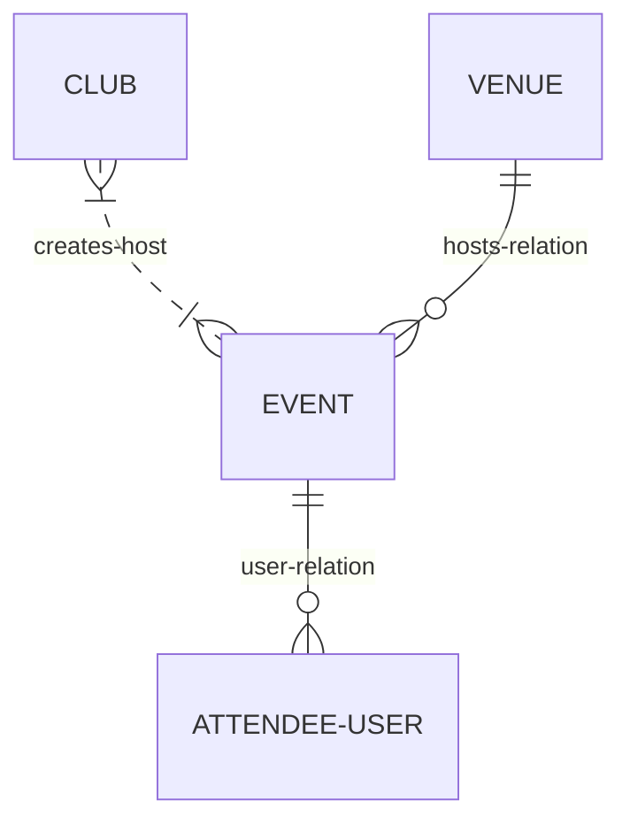
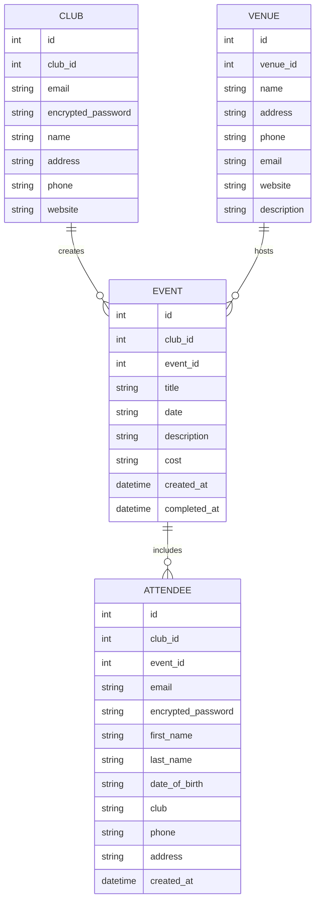

# scene
Event app that allows clubs and organizations to create and share events while allowing members and guests to find and join events.

## Domain Diagram

```mermaid
    erDiagram
        CLUB }|..|{ EVENT : creates-host
        VENUE ||--o{ EVENT : hosts-relation
        EVENT ||--o{ ATTENDEE-USER : user-relation
```

# ERD

```mermaid
    erDiagram
        CLUB ||--o{ EVENT : creates
        CLUB {
            int id
            int club_id
            string email
            string encrypted_password
            string name
            string address
            string phone
            string website
        }
        VENUE ||--o{ EVENT : hosts
        VENUE {
            int id
            int venue_id
            string name
            string address
            string phone
            string email
            string website
            string description
        }
        EVENT ||--o{ ATTENDEE : includes
        EVENT {
            int id
            int club_id
            int event_id
            string title
            string date
            string description
            string cost
            datetime created_at
            datetime completed_at
        }
        ATTENDEE {
            int id
            int club_id
            int event_id
            string email
            string encrypted_password
            string first_name
            string last_name
            string date_of_birth
            string club
            string phone
            string address
            datetime created_at
        }
```