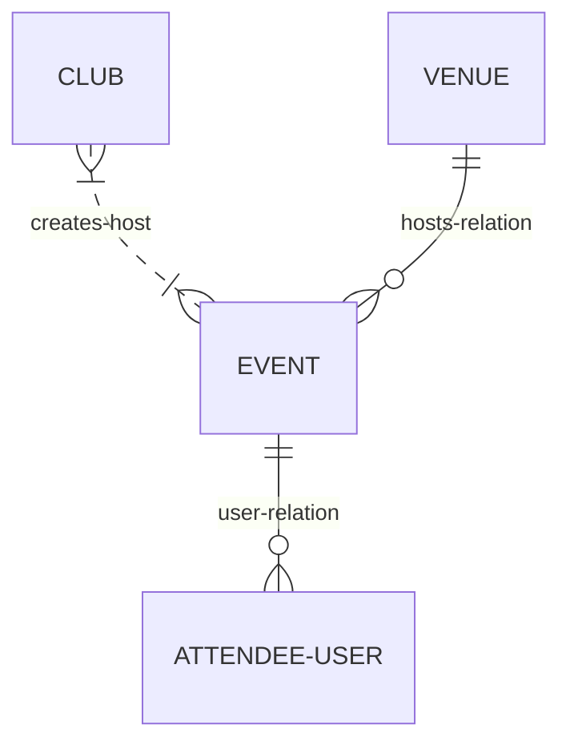

# scene
Event app that allows clubs and organizations to create and share events while allowing members and guests to find and join events.

## Domain Diagram


<!-- # ERD
```mermaid
    erDiagram
        USER ||--o{ LIST : creates
        USER {
            int id
            string email
            string encrypted_password
        }
        USER ||--o{ CATEGORY : creates
        CATEGORY {
            int id
            int user_id
            string color_code
            string title
        }
        CATEGORY ||--o{ LIST : includes
        LIST ||--|{ LIST-ITEM : includes
        LIST {
            int user_id
            int category_id
            string title
            datetime created_at
        }
        LIST-ITEM {
            int id
            int list_id
            int position
            string title
            datetime created_at
            datetime completed_at
        }
``` -->